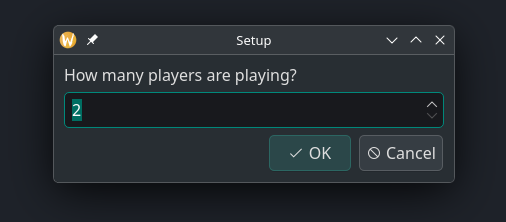

# Rummikub

A C++ solver for the game Rummikub. This code implements a GUI interface for Rummikub and the possibility to let an algorithm find the best move for you in every turn. All you need to do is tell the AI what tiles you draw and replicate the moves of other players. This makes sure that the AI always sees the most recent version of the tiles we own and the sets on the board.

## Features
- **GUI Interface:** Modern interface built using Qt6.
- **AI Player:** Play in the role of an AI player, which maximizes the placed tiles on every move.
- **Interactive Board:** Drag and drop tiles visually to create your runs and groups.
- **Rules Enforcement:** Implements core Rummikub rules including the 30-point initial move requirement.

## Prerequisites
- C++17 compliant compiler
- CMake 3.15 or higher
- Qt 6 (Widgets module)

## Building the Project

1. Clone the repository:
   ```bash
   git clone https://github.com/natorgas/RummikubSolver.git Rummikub
   cd Rummikub
   ```

2. Create a build directory and run CMake:
   ```bash
   mkdir build
   cd build
   cmake ..
   ```

3. Compile the project:
   ```bash
   make
   ```

## Running the Game

After building, execute the compiled binary from the `build` directory:
```bash
./Rummikub
```

## How to Play
1. Enter the number of players.

2. Enter the names of all players. The first name you enter will be the one controlled by the AI, i.e. playing moves that maximize the number of tiles placed in every turn.
3. You will be asked how much time you are 'willing to wait'. This refers to the maximal time the AI is allowed to search for the best move. Once that time is exceeded, the best move it has found so far is returned.
4. Everyone draws their initial tiles. The AI player must tell the AI which tiles they drew. A simple GUI will let the AI player select the drawn tiles. All other players simply draw and no information isgiven to the AI except for the fact that tiles have been drawn.
5. On AI player's turn:
    - Wait for the AI to find the best move.
    - You will be told which and how many tiles the AI player was able to place.
    - If you are playing in real life, take your time to update the real board by copying the newly displayed board which now includes the AI move.
    - If no move was possible this will be communicated to you, draw a tile and tell the AI what you drew.
6. On a human player's turn:
    - Tiles can be spawned during the move of a human. The process of it is self explanatory.
    - Tiles can be dragged and dropped anywhere on the board, according to a human player's moves. Tiles do not have to align perfectly for the program to recoginize that they belong to the same set. You will get a feeling of how much it takes as you play.
    - Once the human player is done you can click the done button. Different checks will be run and you will be informed if a move was invalid, in which case the board will be reset.

## Note on First Move
Your very first move must consist of placing sets that total **at least 30 points** from your own hand without manipulating existing tiles on the board.
